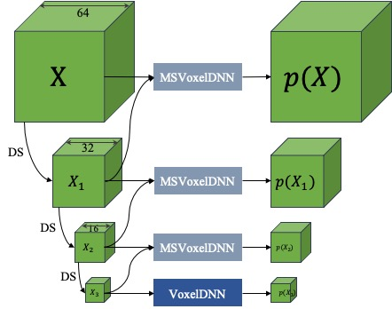

  
  <figcaption>Overview of the MSVoxelDNN architecture with input block of size 64 and 3 scales.</figcaption>
  

# Multiscale deep context modeling for lossless point cloud geometry compression
* **Authors**:
[Dat T. Nguyen](https://scholar.google.com/citations?hl=en&user=uqqqlGgAAAAJ),
[Maurice Quach](https://scholar.google.com/citations?user=atvnc2MAAAAJ),
[Giuseppe Valenzise](https://scholar.google.com/citations?user=7ftDv4gAAAAJ) and
[Pierre Duhamel](https://scholar.google.com/citations?user=gWj_W9YAAAAJ&hl=en&oi=ao)  
* **Affiliation**: Université Paris-Saclay, CNRS, CentraleSupélec, Laboratoire des signaux et systèmes, 91190 Gif-sur-Yvette, France
* **Links**: [[Paper]](https://arxiv.org/abs/2104.09859)

## Prerequisites
* Python 3.8
* PyTorch 1.7.1 

Run command below to install all prerequired packages:
    
    pip3 install -r requirements.txt

## Prepare datasets
The training data are the .ply files containing x,y,z coordinates of points within a 64x64x64 patch divided from Point Clouds. Our Point Clouds download from [ModelNet40](http://modelnet.cs.princeton.edu),[MPEG 8i](http://plenodb.jpeg.org/pc/8ilabs) and [Microsoft](http://plenodb.jpeg.org/pc/microsoft). The ModelNet40 dataset provides train and test folder separately. For MPEG and Microsoft dataset, you must manually select PCs into train and test. Training data generation is similar to this [repo](https://github.com/mauriceqch/pcc_geo_cnn_v2) for each dataset. The commands below first select 200 densiest Point Clouds (PC) from ModelNet40, convert it from mesh to PC and then divide each PC into occupied blocks of size 64x64x64 voxels (saved in .ply format)

        python -m utils.ds_select_largest.py datasets/ModelNet40 datasets/ModelNet40_200 200
        python -m utils.ds_mesh_to_pc.py datasets/ModelNet40_200 datasets/ModelNet40_200_pc512 --vg_size 512
        python -m utils.ds_pc_octree_blocks.py datasets/ModelNet40_200_pc512 datasets/ModelNet40_200_pc512_oct3 --vg_size 512 --level 3 
     
      
You only need to run the last command for MPEG and Microsoft after selecting PCs into `train/` and `test/` folder. Note that MPEG 8i and Microsoft are 10-bits point clouds thus, you must change --vg_size to 1024 and --level to 4:

    python -m utils.ds_pc_octree_blocks datasets/MPEG/10bitdepth/ datasets/MPEG/10bitdepth_2_oct4/ --vg_size 1024 --level 4

The `datsets/` folder of MPEG and Microsoft should look like this:

    dataset/
    └── MPEG/
        └── 10bitdepth/              downloaded PCs from MPEG
            ├── train/               contains .ply PCs for training 
            └── test/                contains .ply PCs for validation         
        └── 10bitdepth_2_oct4/
            ├── train/               contains .ply files of 64x64x64 blocks for training 
            └── test/                contains .ply files of 64x64x64 blocks for validation
    └── Microsoft/
        └── 10bitdepth/              downloaded PCs from Microsoft
            ├── train/               contains .ply PCs for training 
            └── test/                contains .ply PCs for validation         
        └── 10bitdepth_2_oct4/
            ├── train/               contains .ply files of 64x64x64 blocks for training 
            └── test/                contains .ply files of 64x64x64 blocks for validation

## Training
Run the shell script training.sh to train all models:
    
    chmod +x training.sh
    ./training.sh
    
## Encoder
Encoding command: 

    python3 -m  ms_voxel_dnn_coder.ms_voxel_dnn_encoder -level 10 -depth 3 -ply path_to_ply_file -output bitstream_output_folder -signaling msvxdnn -model path_to_trained_models -model8 path_to_voxeldnn_8

Run `python3 -m voxel_dnn_coder.ms_voxel_dnn_encoder -h` for more details about the arguments. The encoder outputs look like this:

    Encoded file:  /TestPC/MPEG_thaidancer_viewdep_vox10.ply
    Encoding time:  23.339358806610107
    Occupied Voxels: 278641
    Blocks bitstream:  Output/MPEG_thaidancer_viewdep_vox10/msvxdnn/blocks.bin
    Baseblock bitstream:  Output/MPEG_thaidancer_viewdep_vox10/msvxdnn/baseblocks.bin
    Metadata bitstream Output/MPEG_thaidancer_viewdep_vox10/msvxdnn/metadata.bin
    Encoding information:  Output/MPEG_thaidancer_viewdep_vox10/msvxdnn/heatmap.pkl
    Average bits per occupied voxels: 0.73
    Percent of base level: 0.0070
    Total file size:  203463

This `Output/MPEG_thaidancer_viewdep_vox10/msvxdnn/heatmap.pkl` file contains encoding statics for all blocks 64 including number of occupied voxels and number of bits spent for each layer.

## Citation

    @article{nguyen2021multiscale,
      title={Multiscale deep context modeling for lossless point cloud geometry compression},
      author={Nguyen, Dat Thanh and Quach, Maurice and Valenzise, Giuseppe and Duhamel, Pierre},
      journal={arXiv preprint arXiv:2104.09859},
      year={2021}
    }
